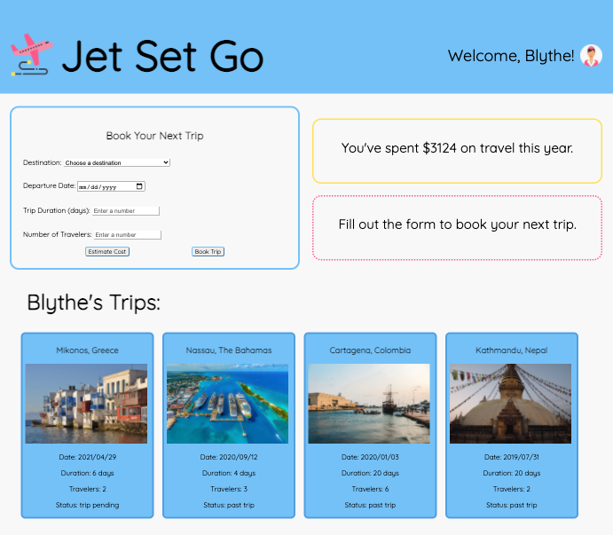
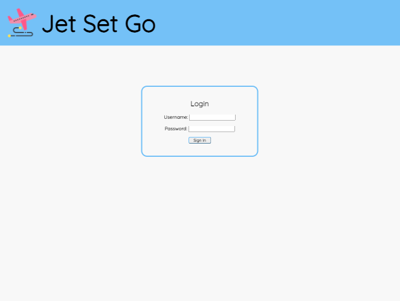
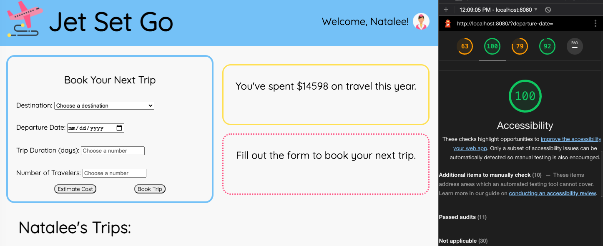

# Jet Set Go

## Overview

Jet Set Go is a travel tracking app developed by [Christina Cook](https://github.com/christina-cook). This is the final solo project for Mod 2 of [Turing School of Software & Design](https://turing.io/)'s front-end engineering program. This application uses Object Oriented Programming to drive the design and codebase of the application, and it works with an API to send and receive data. A detailed spec for the assignment can be found [here](https://frontend.turing.io/projects/travel-tracker.html).



## Technologies Used

- JavaScript
- HTML
- Sass/SCSS
- WebPack
- Chai & Mocha
- Local Server API

## Setup & Installation

To view and use the application, clone down this repository and install npm. Run npm and open localhost:8080 in your browser: 

```
git clone git@github.com:christina-cook/travel-tracker.git
npm install
npm start
```

To run the test suite:

`npm test`

## Using the App

To use the app, a user logs in with a username and password. 



Credentials for user login:

```
username: travelerX (where X is the ID of the user - any number between 1 and 50)
password: travel2020
```

Once logged in, a user is greeted with a personalized dashboard with all of their trip data. Trips are sorted by date, starting with most recent, and include a status code indicating if the trip is a current, upcoming, past or pending trip. A user can request to book a new trip using the booking form, as well as view estimates for the cost of the new trip prior to booking. A yearly amount is displayed at the top of the page for a user to keep track of their total spending, which gets updated each time a new trip is booked.

## View the App in Action


## App Responsiveness


### Accessibility

The Jet Set Go app has a Lighthouse accessibility score of 100. 


